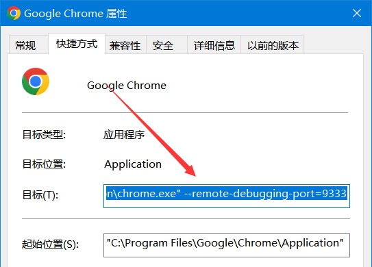
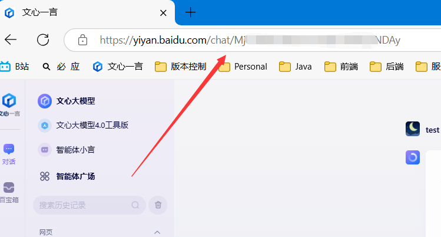
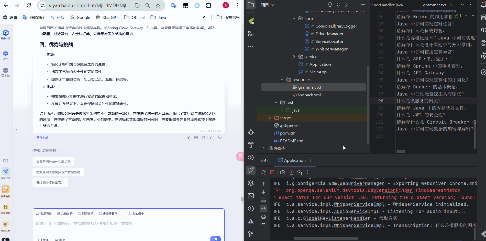

# gpt-whisper-spring

Integrating *GPT* and *Whisper* APIs Into *Spring* Boot Microservice
将*GPT*和*Whisper* API 集成到*Spring*中。

基础功能：利用 Whisper 进行实时音频转录，并利用 GPT生成提示和解决方案。

### 运行环境

JKD11+\Maven3.x\google浏览器

谷歌官网下载: https://zh-googe.com/

### 技术栈

selenium\whisper\spring\logback\jnativehook

### 平台支持

该项目仅支持以下平台：

- Windows10 x86_64


### 使用说明

1 设置 Chrome 远程调试端口
 右键点击 Chrome 的快捷方式图标，选择属性
 在目标一栏，最后加上` --remote-debugging-port=9222`注意要用空格隔开



2 登录[文心一言](https://yiyan.baidu.com/) ,开启新对话获取新链接地址




3 修改配置文件AI_URL

```
public interface AppConfig {
    /**
     * ai url
     */
    String AI_URL = "https://yiyan.baidu.com/chat/MjU4MDIzMjI5OTo0NjY0NjQxMjcy";
    // 测试
    String REMOTE_BROWSER_IP_AND_PORT = "127.0.0.1:9333";
    String LOCAL_BROWSER_PARAMS = "";
...
}
```

4 启动项目 


5 按下获取答案键PrtSc

捕获最近10秒的语音->将其转义文字->交给selenium操作


最终效果




### 遗留问题

退出操作后清理相关资源

```
tasklist |findstr /i "chrome"
taskkill /im chromedriver.exe /F
```

使用chatgpt

直接通过语音转文字服务

直接调用openAi服务

### 相关项目

https://github.com/GiviMAD/whisper-jni
